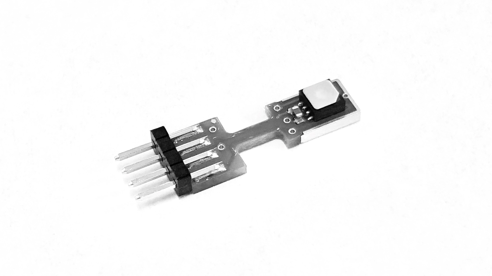

## Project under construction :construction:
This project are curently (2019/08/20) under construction.

---

# SHT85 Library
Open source UWP library for communication with Sensirion Humidity Sensor SHT85. 

This library targets __UWP IoT projects__! Download directly from NuGet [Rca.Sht85Lib on NuGet](https://nuget.org/packages/Rca.Sht85Lib).


[](https://ci.appveyor.com/project/100prznt/rca-sht85lib)   [](https://www.nuget.org/packages/Rca.Sht85Lib/)   [](#) 



### Hardware functionality
* SingleShot support (temperature and rel. humidity)
* Periodic data acquisition support incl. timestamp
* Control sensor heater
* Read serial and status-register

### Software features
* Physics calculator for:
	* Dew point
	* Absolute humidity
	* Vapour-pressure
	* Saturation-vapour-pressure


## How To install?
Download the source from GitHub or get the compiled assembly from NuGet [Rca.Sht85Lib on NuGet](https://nuget.org/packages/Rca.Sht85Lib).

[](https://www.nuget.org/packages/Rca.Sht85Lib/)   [](https://www.nuget.org/packages/Rca.Sht85Lib/)


## How to use?
All measured and calculated values are of the data type `double` and are given in the following units:

| Value                      | Unit   | Range  |
|:---------------------------|:-------|:-------|
| __Temperature__            | __°C__ |        |
| __Relative humidity__      | __%RH__| 0..100 |
| Absolute humidity          | %      | 0..100 |
| Dew point                  | °C     |        |
| Vapour pressure            | hPa    |        |
| Saturation vapour pressure | hPa    |        |


In the following a few basic usage examples of the library.

### Create an sensor instance
In this example is the I2C address of conneted SHT85 sensor set to default (0x44 factory-fixed):
```cs
var mySht85Sensor = new Rca.Sht85Lib.Sht85();
```

	
### Perform and read measurement
Perform a single reading with default repeatability "low":
```cs
var measData = mySht85Sensor.SingleShot(); //Tuple<double, double>
var temperature = measData.Item1;          //double
var humidity = measData.Item2;             //double
```


### Periodic Data Acquisition Mode
Start the periodic data acquisition mode with specified measure mode:
```cs
void StartPeriodicDataAcquisitionMode()
{
	//...
	mySht85Sensor.NewMeasData += mySht85Sensor_NewMeasData;
	mySht85Sensor.StartPeriodicDataAcquisitionMode(PeriodicMeasureModes.High10Hz);
	//...
}
```
Method to receive the `NewMeasData` event. The update rate depends on the selected measure mode and the hardware runtimes:
```cs
void mySht85Sensor_NewMeasData(Tuple<DateTime, double, double> measData)
{
	var timeStamp = measData.Item1;   //DateTime object
	var temperature = measData.Item2; //double
	var humidity = measData.Item3;    //double
}
```


### Use the Physics.Calculator
The library also offers a calculator, which offers the possibility to calculate further sizes.
`measData` is an `Tuple<double, double>` object (Item1: temperature in °C; Item2: rel. humidity in %RH), e.g. provided by `SigleShot()`.
```cs
var myCalculator = new Rca.Sht85Lib.Physics.Calculator();

var dewPoint = myCalculator.DewPoint(measData);            //double
var absHumidity = myCalculator.AbsoluteHumidity(measData); //double
```


## Credits
This library is made possible by contributions from:
* [Elias Rümmler](http://www.100prznt.de) ([@rmmlr](https://github.com/rmmlr)) - core contributor

## License
Rca.Sht85Lib is licensed under [MIT](http://www.opensource.org/licenses/mit-license.php "Read more about the MIT license form"). Refer to [LICENSE.txt](https://github.com/100prznt/Rca.Sht85Lib/blob/master/LICENSE.txt) for more information.

## Contributions
Contributions are welcome. Fork this repository and send a pull request if you have something useful to add.


[](https://ci.appveyor.com/project/100prznt/rca-sht85lib)


## Related Projects
* [OpenPoolControl](https://github.com/100prznt/opc)
